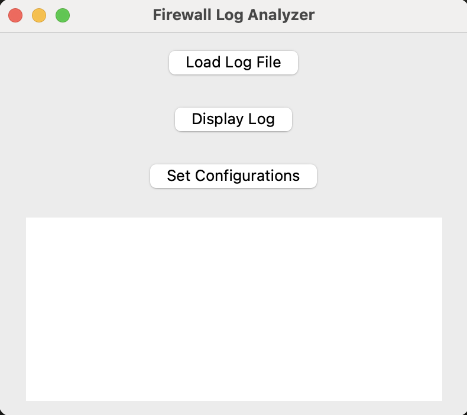

# Firewall Log Analyzer

A simple Python application for analyzing firewall log files with a graphical user interface (GUI).

## Features

- Load and display firewall log files.
- Basic configuration settings (placeholder for future enhancements).

## Screenshots
<div align="center">
    
</div>

## Requirements

- Python 3.x
- pandas

## Installation

1. Clone the repository or download the files.
2. Navigate to the project directory.
3. (Optional but recommended) Create a virtual environment:

   ```bash
   python -m venv venv
   ```

4. Activate the virtual environment:
   - On Windows:

     ```bash
     venv\Scripts\activate
     ```

   - On macOS/Linux:

     ```bash
     source venv/bin/activate
     ```

5. Install the required packages using pip:

   ```bash
   pip install -r requirements.txt
   ```

## Usage

1. Run the application:

   ```bash
   python firewall_log_analyzer.py
   ```

2. Click on "Load Log File" to select a log file.
3. Click on "Display Log" to view the contents of the loaded log file.
4. Use "Set Configurations" to access configuration settings (currently a placeholder).

## License

This project is licensed under the MIT License - see the [LICENSE](LICENSE) file for details.
